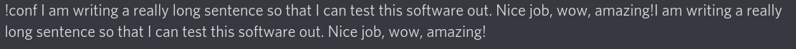
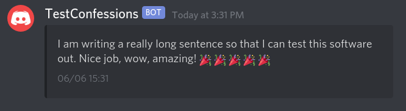

# HuskyBot
A Discord bot for the Northeastern '24 server. 

## Features

* Private message a bot and have it output your message into a separate channel (anonymously)!
* User verification (outside members who DM the bot will fail)

## Screenshots

**Example Private Message**

**Example Output**

## Running
    # For the host:
    python bot.py

    # For the user:
    Private message a bot: !conf (message)

## Things the User Must Do
Before running the bot, add the following 2 IDs in the bot.py file (at the top):
* Channel ID (int)
* Bot Token ID (string)

## Requirements
Requires Python, discord.py and NodeJS.

## Installing discord.py
    # Linux/macOS
    python3 -m pip install -U discord.py

    # Windows
    py -3 -m pip install -U discord.py
